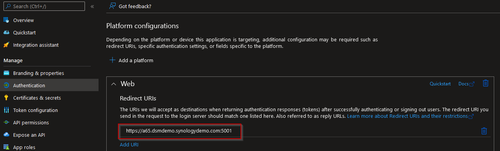

# LDAP-wrapper for AzureAD users/groups [](https://github.com/ahaenggli/AzureAD-LDAP-wrapper) <a href="https://www.buymeacoffee.com/ahaenggli" target="_blank"></a>

AzureAD-LDAP-wrapper is a nodejs ldap server ([ldapjs](https://github.com/ldapjs/node-ldapjs)) that provides AzureAD users and groups via LDAP protocol. User authentication is done through Microsoft Graph Api. As a result, other applications can connect to the LDAP server, allowing users to use their familiar AzureAD login information. This is especially useful for (older) applications that do not (yet) support AzureAD and for which you do not want to maintain a local AD controller.

## Table of Contents

* [Motivation and background information](#motivation-and-background-information)
  * [How the server works](#how-the-server-works)
  * [Important information about samba](#important-information-about-samba)
* [Installation](#installation)
  * [Required settings in AzureAD](#required-settings-in-azuread)
  * [Docker container - general settings](#docker-container---general-settings)
  * [Setup on a Synology NAS](#setup-on-a-synology-nas)
  * [Update Docker container on a Synology NAS](#update-docker-container-on-a-synology-nas)
  * [Synology SSO](#synology-sso)  
* [Security](#security)
* [Troubleshooting](#troubleshooting)
* [environment variables](#environment-variables)

## Motivation and background information

I personally run the project in a Docker container on my Synology NAS. The NAS and some intranet web applications are connected to the ldap server. This way my users can log in to the NAS, the web applications and of course office.com with the same credentials.
The whole thing could probably also be achieved by [joining the NAS to AADDS](https://kb.synology.com/en-global/DSM/tutorial/How_to_join_NAS_to_Azure_AD_Domain). However, I was not willing to pay that much for a virtual machine/VPN/AADDS only that my 3 users can use the same credentials (almost) everywhere.

### How the server works

1. AzureAD-LDAP-wrapper starts an LDAP server
2. On "starting" users and groups are fetched from Azure Active Directory
3. On "bind" the user credentials are checked through Microsoft Graph API
4. On successful "bind" the user password is saved as additional hash (sambaNTPassword) and sambaPwdLastSet ist set to "now". This is necessary to allow access from e.g. Windows PCs to the samba shares on the NAS.
5. Users and groups are fetched again every 30 minutes  
(while keeping uid, gid, sambaNTPassword and sambaPwdLastSet)

### Important information about samba

To access a share on the NAS, for example, from a Windows PC, the credentials must be entered. These credentials are NOT sent to the LDAP-wrapper (or any other LDAP server). They are sent to samba so that it can generate a hash from the password. Afterwards samba fetches the password hash from the LDAP-wrapper and compares the two hashes. Perhaps you are now wondering why this is important to know?
Well, the AzureAD-LDAP-wrapper must have this hash before you access a shared folder. Otherwise, you will get an error due to invalid credentials. Perhaps you are now wondering how the LDAP-wrapper can obtain the necessary hash? The answer is simple: The user MUST first log in to a service (DSM, web application, etc.) that is directly connected to the LDAP-wrapper. Only after that the login in samba can work. The same applies after a password change. The new password has a new hash, so the user must first log in again via another service. This restriction cannot be circumvented. And last but not least: MFA/2FA (multi-factor authentication or two-factor authentication) is also not supported by this method.

## Installation

### Required settings in AzureAD

1. Register a new App in your [aad-portal](https://aad.portal.azure.com/#blade/Microsoft_AAD_IAM/ActiveDirectoryMenuBlade/RegisteredApps) as described [here](https://docs.microsoft.com/en-us/azure/active-directory/develop/howto-create-service-principal-portal).
2. Set the following Graph-API Application permissions:  

For type `Application`  allow `User.Read.All` and `Group.Read.All`.  
For type `Delegated` allow `User.Read`.
3. Set [Treat application as a public client](https://github.com/AzureAD/microsoft-authentication-library-for-dotnet/wiki/Username-Password-Authentication#application-registration) to `Yes`  
(former "Allow public client flows")
4. Copy and save those values for the later use as environment variables in the Docker container.
   - Directory (tenant) ID from the page "overview" as `AZURE_TENANTID`.  
   A description with printscreen can be found [here in #3](https://docs.microsoft.com/en-us/azure/active-directory/develop/howto-create-service-principal-portal#get-tenant-and-app-id-values-for-signing-in).
   - Application (client) ID from the page "overview" as `AZURE_APP_ID`.  
   A description with printscreen can be found [here in #4](https://docs.microsoft.com/en-us/azure/active-directory/develop/howto-create-service-principal-portal#get-tenant-and-app-id-values-for-signing-in).
   - Value of a (new) client secret from the page "Certificates & secrets" as `AZURE_APP_SECRET`.  
   A description with printscreen can be found [here in #5](https://docs.microsoft.com/en-us/azure/active-directory/develop/howto-create-service-principal-portal#option-2-create-a-new-application-secret).
5. Use a [docker container](https://hub.docker.com/r/ahaen/azuread-ldap-wrapper) (or any other method to run this LDAP-wrapper) and start it with the correct environment variables.

### Docker container - general settings

This is a minimal example for a running configuration.

```bash
AZURE_APP_ID="abc12345-ab01-0000-1111-a1e1eab9d6dd"
AZURE_TENANTID="0def2345-ff01-56789-1234-ab9d6dda1e1e"
AZURE_APP_SECRET="iamasecret~yep-reallyreallysecret"
LDAP_DOMAIN="example.com"
LDAP_BASEDN="dc=example,dc=com"
LDAP_BINDUSER="root|mystrongpw||ldapsearch|ldapsearchpw123"
```

As domain and basedn it is recommended to use the same as used in AzureAD tenant (e.g. `@domain.tld`). This way, the spelling of the users (e.g. `username@domain.tld`) will match at the end. Otherwise, your users will have to use `username@example.com` instead of the estimated `username@domain.tld`, for example.

The API results and a local copy of the LDAP entries are stored as JSON files inside the container at this path: `/app/.cache`  
Map this folder to provide persistent storage for your users/groups (and their Samba password hashes). Be aware that other users in the file system may also be able to read the JSON files and thus get access to the cached sambaNTPassword attribute.

For local testing you could create a .env file with your environment variables in there and pass it to docker run like that:

```bash
docker run -d -p 389:13389 --volume /home/mydata:/app/.cache --env-file .env ahaen/azuread-ldap-wrapper:latest
```

### Setup on a Synology NAS

1. Open Docker > Registry to download the Image  
Open Docker > Image to launch a new container  
Configure and start it

For the network use bridge as we have to map the local Port 389 to the container. Make sure you double check your Azure values and define at least 1 binduser. The binduser does not need to exist in your AzureAD. Don't forget to replace example.com with your domain. Map the `/app/.cache` folder in Volume. If you receive the error `Local port 389 conflicts with other ports used by other services`: Please make sure that Synology Directory Service and Synology LDAP Server are not installed - they also use this port.

2. Enable ldap-client and connect it to your docker container


3. Users that exist in the AAD cannot see or change other users password hashes. So, if you'd like to use samba, please join/bind with a (not in AzureAD existing) user from the previously defined env var `LDAP_BINDUSER`: 
The warning a local group has the same name as a synchronized group can be skipped.

4. Give your synchronized groups the desired permissions and log in with your synchronized users :)

5. Before accessing shared folders/files via network/samba, each user must log in to dsm-web-gui or another tool directly connected to the ldap server. This also applies after a password change, since the password hash for samba is only set after a successful login.

### Update Docker container on a Synology NAS

1. Redownload the latest version

2. Stop your container
3. Clear your container

4. Check the [changelog](CHANGELOG.md) file (for breaking changes) and apply new settings
5. Start your container
6. Check the logs for (new) errors (right click on container and choose "Details")

7. Before accessing files via network/samba, each user needs to login in the dsm-web-gui or any other tool directly connected to the ldap server. It's the same after a password change, because the password-hash for samba is only set after a successfull login.

### Synology SSO

If you don't need samba (network access for shared folders) you can try enabling the Synology OpenID Connect SSO service.
Please be aware, it's not working on every DSM version. First tests on a Synology Live Demo with DSM 7.1-42661 were successfull. Unfortunately it didn't work locally on my personal NAS, probably because it'ss behind a Firewall/Proxy.

1. Add your URL to access the NAS in Azure

2. Go to Domain/LDAP > SSO Client and  Tick Enable OpenID Connect SSO service
3. Select azure as the profile and set the same appid, tenant and secret you used for the docker container. The redirect URI is again your URL to access the NAS.

4. Save everything
5. You should now see 'Azure SSO Authentication' on your DSM login screen


## Security

Unfortunately, an LDAP search on the NAS must be possible without any authentication in order to be able to select the domain/baseDN at all. Since this wrapper is originally only meant to use the same credentials as in Azure on a NAS, this is the default behaviour. Therefore, some queries may be run as anonymous by default. You can change this via the env var [LDAP_ANONYMOUSBIND](#ldap_anonymousbind-default-domain) if required.

Another way to make the LDAP-wrapper more secure would be to restrict access through a firewall and thus not allow access to everyone and anyone on the network.

## Troubleshooting

The first step is always to look at the Docker log. Many errors are handled there. For further steps, e.g. Samba debugging, read the [FAQ](./FAQ.md). If you get stuck, feel free to open an issue - but please add the log files, maybe others will be able to read more from them than you.

## environment variables

The following is a list of all possible environment variables and settings.

### AZURE_APP_ID

Your `Application ID` from [azure](https://docs.microsoft.com/en-us/azure/active-directory/develop/howto-create-service-principal-portal#get-tenant-and-app-id-values-for-signing-in) (see #4)

### AZURE_TENANTID

Your `Tenant ID` from [azure](https://docs.microsoft.com/en-us/azure/active-directory/develop/howto-create-service-principal-portal#get-tenant-and-app-id-values-for-signing-in) (see #3)

### AZURE_APP_SECRET

A `Client secret`-value from [azure](https://docs.microsoft.com/en-us/azure/active-directory/develop/howto-create-service-principal-portal#option-2-create-a-new-application-secret)

### GRAPH_FILTER_USERS

This allows you to filter the users in the graph api using the [$filter](https://docs.microsoft.com/en-us/graph/query-parameters#filter-parameter) query parameter.  
The default filter is set to `userType eq 'Member'`. That's why external users (guests) will not be synced automatically by default.

### GRAPH_FILTER_GROUPS (optional)

This allows you to filter the groups in the graph api using the [$filter](https://docs.microsoft.com/en-us/graph/query-parameters#filter-parameter) query parameter. The default filter is empty, so all groups are synchronized. For example, you can set it to `securityEnabled eq true` so that only security groups are synchronized and not every single Teams group. More properties to filter are documented [here](https://docs.microsoft.com/en-us/graph/api/resources/group?view=graph-rest-1.0#properties).

### LDAP_DOMAIN

main domain

### LDAP_BASEDN

basedn

### LDAP_SAMBADOMAINNAME (optional)

Default is the first part of your baseDN, for `dc=example,dc=net` it would be `EXAMPLE`. For any other value, just set it manually with this env ar.

### LDAP_BINDUSER (optional without SMB)

Every AzureAD-user can bind (and auth) in this LDAP-Server.
This parameter allows you to add additional - NOT in AzureAD existing - users.
Format: "username|password". This can be useful to "join" a device (e.g. NAS).
Multiple users can be split by "||". (e.g. `ldapsearch1|mysecret||searchy2|othersecret`).
Those users are superusers (e.g. root, admin, ...) and have full read and modify permissions and can also see the sambaNTPassword-hash.

### LDAP_ANONYMOUSBIND (default: domain)

Depending on the value, anonymous binding is handelt differently

* none: no ldap query allowed without binding
* all: all ldap query are allowed without binding
* domain: only the domain entry is visible without binding

### LDAP_DEBUG (default: false)

If set to true there are more detailed logs in the console output.

### LDAP_PORT (default: 13389)

Sets the port for the listener. The wrapper listens on port 13389 by default.
However, if you are running a Docker container directly on the host network, you may want to change the port to 389.

### LDAP_SECURE_ATTRIBUTES (optional)

Allows to define secure attributes. Onlye superusers can see them all.
Multiple attributes can be split by "|". (e.g. `customSecurityAttributes_*|PlannedDischargeDate`).

### LDAP_SENSITIVE_ATTRIBUTES (optional)

Allows to define sensitive attributes. Each user can see his own values, but not those of another user.
Additionally, superusers can see them all, too.
Multiple attributes can be split by "|". (e.g. `middlename|PrivatePhoneNumber`).

### LDAP_ALLOWCACHEDLOGINONFAILURE (default: true)

allows login from cached sambaNTPassword.
If set to true, the login has failed and the error does NOT say "wrong credentials", the password is checked against the cached sambaNTPassword. If it matches, the authentification is successfull.

### LDAP_SAMBANTPWD_MAXCACHETIME (optional, default: infinity)

Maximum time in minutes that defines how long a cached sambaNTPassword hash can be used (for login and samba access).
After that time, a user has to login 'normal' via the bind method (e.g. dsm-web-gui) to reset the cached value.
As default there is no time limit (-1=infinity).

### LDAPS_CERTIFICATE

Path to your certificate.pem file.
You also have to set `LDAPS_KEY` to run LDAP over SSL.
You may also need to set `LDAP_PORT` to 636.

### LDAPS_KEY

Path to private key file.
You also have to set `LDAPS_CERTIFICATE` to run LDAP over SSL.
You may also need to set `LDAP_PORT` to 636.

### LDAP_SYNC_TIME

The interval in minutes for fetching users/groups from azure. The default is 30 minutes.

### SAMBA_BASESID (optional)

Base SID for all sambaSIDs generated for sambaDomainName, groups and users. Default is `S-1-5-21-2475342291-1480345137-508597502`.

### DSM7

If set to `true` the ldap attributes uidNumber and gidNumber are converted from strings to numbers.
Somehow this seems to be necessary to work with DSM 7.0. The default value is `false`.

### LDAP_SAMBA_USEAZURESID (default: true)
Use the calculated SIDs for users/groups from AzureAD (GUID/ObjectId) instead of a "randomly" generated one. You can enable the old handling by setting the env var `false`.

### HTTPS_PROXY or HTTP_PROXY (optional)
URL to your proxy, e.g. http://192.168.1.2:3128
