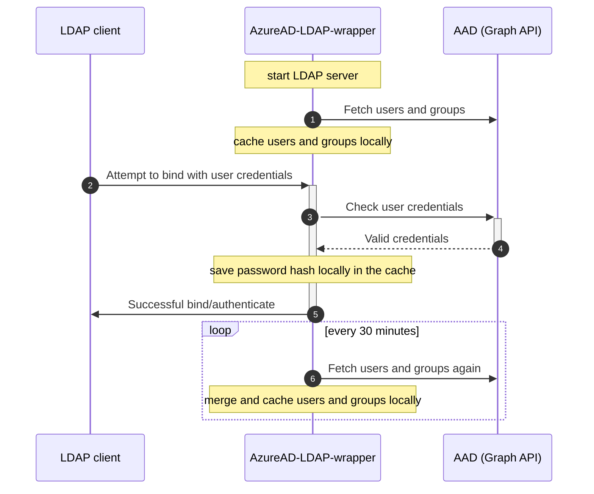

# LDAP-wrapper for AzureAD users/groups  

AzureAD-LDAP-wrapper is a Node.js LDAP server built on top of ([ldapjs](https://github.com/ldapjs/node-ldapjs)) that allows users and groups from Azure Active Directory to be accessed through the LDAP protocol. User authentication is performed using Microsoft Graph API on every login attempt. This enables other applications to connect to the LDAP server and utilize AzureAD login credentials, making it a possible solution for older applications that lack AzureAD support or for scenarios where managing a local AD controller is undesirable.

## Table of Contents

* [Background](#background)
* [Installation](#installation)
  * [Azure AD application](#create-an-azure-ad-application)
  * [run the wrapper](#run-the-wrapper)
* [Usage](#usage)
* [Troubleshooting](#troubleshooting)
* [Security](#security)
* [Contributing](#contributing)
* [Support this project](#support-this-project)
* [License](#license)

## Background

The AzureAD-LDAP-wrapper starts an LDAP server and fetches users and groups from the AAD Graph API. These are cached and merged locally.

When an LDAP client attempts to bind with user credentials, the AzureAD-LDAP-wrapper checks these credentials by communicating with the AAD Graph API. If the credentials are valid, the AAD Graph API sends a success response to the AzureAD-LDAP-wrapper, which then sends a successful bind message to the user's LDAP client. Additionally, the AzureAD-LDAP-wrapper saves the user's password hash in the sambaNTPassword attribute and sets the sambaPwdLastSet attribute to "now". This allows the user to access samba shares, such as those on a NAS, from Windows PCs.

The AzureAD-LDAP-wrapper periodically fetches user and group information from the AAD Graph API every 30 minutes, merging and caching the results locally. This process preserves attributes like uid, gid, sambaNTPassword, and sambaPwdLastSet.

## Installation

### Create an Azure AD application

Before you can use the AzureAD-LDAP-wrapper, you need to create an Azure AD application and grant it the necessary permissions:

* For type `Application` grant `User.Read.All` and `Group.Read.All`.
* For type `Delegated` grant `User.Read`.

Feel free to follow the [instructions provided in the guide](<https://ahaenggli.github.io/AzureAD-LDAP-wrapper/installation/create-azuread-application/>), which includes helpful screenshots, to set up your Azure AD application and grant it the necessary permissions.

To run the AzureAD-LDAP-wrapper, you'll need to have your Tenant ID, Application ID, and Application Secret available. These values are required to authenticate and authorize the application to access your Azure AD resources. You can find these values in the Azure portal.

### Run the wrapper

Once you have created your Azure AD application, you can run the LDAP wrapper on your local machine, on a server or even a Synology NAS. Follow the instructions in the [guide](https://ahaenggli.github.io/AzureAD-LDAP-wrapper/installation/run-ldap-wrapper/) to get started.

.. tbd ...

## Usage

.. tbd ...

## Troubleshooting

If you encounter any issues, start by checking the Docker log. Many errors are logged there, and this can help you identify the root cause of the problem. Additionally, the [troubleshooting page](https://ahaenggli.github.io/AzureAD-LDAP-wrapper/troubleshooting/) in the documentation provides further guidance on debugging common issues, including Samba-related ones. If you're still stuck, don't hesitate to open an issue, but be sure to attach relevant log files to help others diagnose the issue.

## Security

It's important to note that the AzureAD-LDAP-wrapper involves transferring sensitive user information, so it's essential to ensure that it's used securely. There are several potential security risks to be aware of when using this wrapper. For more information on these risks and how to mitigate them, please read the [security page](https://ahaenggli.github.io/AzureAD-LDAP-wrapper/security/) in the documentation.

If you discover any security vulnerabilities, please refer to the instructions in [SECURITY.md](SECURITY.md) on how to report them.

## Contributing

Contributions to the AzureAD-LDAP-wrapper are always welcome! If you have any suggestions, bug reports, or pull requests, please feel free to open an issue or a pull request on the project's GitHub repository.

## Support this project

If you find this project helpful or saved you time and effort, please consider giving it a star and/or making a donation.
 ()

Your support helps me maintain and improve this project. Thank you!

## License

The AzureAD-LDAP-wrapper is licensed under the [MIT License](LICENSE).
