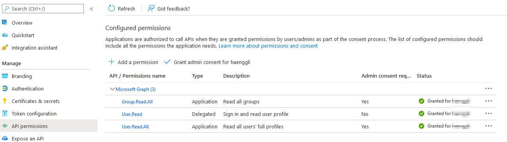
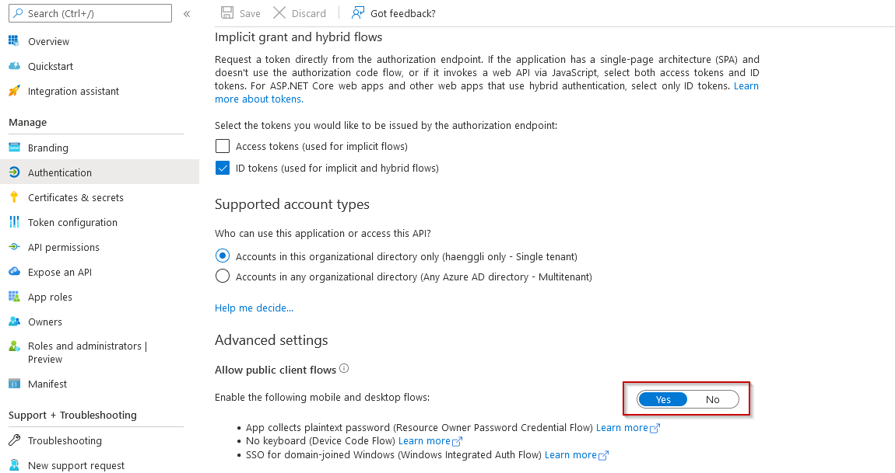
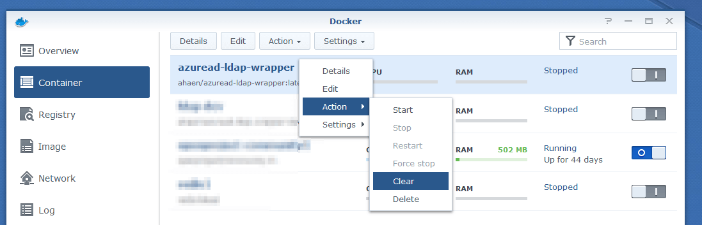

# LDAP-Wrapper for 'microsoft 365' users (former 'office 365' - via AzureAD without AADDS) [](https://github.com/ahaenggli/AzureAD-LDAP-wrapper) <a href="https://www.buymeacoffee.com/ahaenggli" target="_blank"></a>

AzureAD-LDAP-wrapper is pseudo-ldap-server for authenticating against Microsoft 365 (AzureAD).
This is especially useful when you don't want to maintain an on-premise AD controller.

## How it works

1. AzureAD-LDAP-wrapper starts an LDAP server
2. On 'starting' all users and groups are fetched from Azure Active Directory
3. On 'bind' the user credentials are checked with the Microsoft Graph API
4. On successful 'bind' the user password is saved as additional hash (sambaNTPassword) and sambaPwdLastSet ist set to "now" to allow use/access to samba shares
5. Users and groups are fetched again every 30 minutes  
(while keeping uid, gid, sambaNTPassword and sambaPwdLastSet)

## How to use it

1. Register a new App in your [aad-portal](https://aad.portal.azure.com/#blade/Microsoft_AAD_IAM/ActiveDirectoryMenuBlade/RegisteredApps) as described [here](https://docs.microsoft.com/en-us/azure/active-directory/develop/howto-create-service-principal-portal)
2. Set the following Graph-API Application permissions:  
`User.Read.All` and `Group.Read.All` for `Application`  
`User.Read` for `Delegated`  

3. Set [Allow public client flows](https://github.com/AzureAD/microsoft-authentication-library-for-dotnet/wiki/Username-Password-Authentication#application-registration) to `Yes` 
4. Use a [docker container](https://hub.docker.com/r/ahaen/azuread-ldap-wrapper) and start it with the right environment variables.

### Using with Docker on Synology-NAS

1. Add the ldap-wrapper as a container, configure it and start it


2. Enable ldap-client and connect it to your docker container


3. Users that exist in the AAD cannot see or change other users' passwords. So, if you'd like to use samba, please join/bind with a (not in AzureAD existing) user from the env var `LDAP_BINDUSER`: 

4. Give your synced groups the permissions you want and login with your azuread-users :)

5. Before accessing files via network/samba, each user needs to login in the dsm-web-gui or any other tool directly connected to the ldap server. It's the same after a password change, because the password-hash for samba is only set after a successfull login.

### Update a container on Synology-NAS

1. Redownload the latest version

2. Stop your container
3. Clear your container

4. Check the [changelog](CHANGELOG.md) file and apply new settings
5. Start your container
6. Check the logs for (new) errors (right click on container and choose "Details")

7. Before accessing files via network/samba, each user needs to login in the dsm-web-gui or any other tool directly connected to the ldap server. It's the same after a password change, because the password-hash for samba is only set after a successfull login.

## General Installation

The API-Results and a local copy of the LDAP-Entries are saved in here: /app/.cache

Attention: If you map this folder, the files will be persistent, but other users could maybe see the cached sambaNTPassword-value in there.

## environment variables

### example

This is a minimal example for the a running configuration.

```bash
AZURE_APP_ID="abc12345-ab01-0000-1111-a1e1eab9d6dd"
AZURE_TENANTID="0def2345-ff01-56789-1234-ab9d6dda1e1e"
AZURE_APP_SECRET="iamasecret~yep-reallyreallysecret"
LDAP_DOMAIN="example.com"
LDAP_BASEDN="dc=example,dc=com"
LDAP_BINDUSER="ldapsearch|ldapsearch123"
```

### AZURE_APP_ID

Your `Application ID` from [azure](https://docs.microsoft.com/en-us/azure/active-directory/develop/howto-create-service-principal-portal#get-tenant-and-app-id-values-for-signing-in) (see #4)

### AZURE_TENANTID

Your `Tenant ID` from [azure](https://docs.microsoft.com/en-us/azure/active-directory/develop/howto-create-service-principal-portal#get-tenant-and-app-id-values-for-signing-in) (see #3)

### AZURE_APP_SECRET

A `Client secret`-value from [azure](https://docs.microsoft.com/en-us/azure/active-directory/develop/howto-create-service-principal-portal#option-2-create-a-new-application-secret)

### GRAPH_FILTER_USERS

This allows you to filter the users in the graph api using the [$filter](https://docs.microsoft.com/en-us/graph/query-parameters#filter-parameter) query parameter.  
The default filter is set to `userType eq 'Member'`. That's why external users (guests) will not be synced automatically by default.

### GRAPH_FILTER_GROUPS (optional)

This allows you to filter the groups in the graph api using the [$filter](https://docs.microsoft.com/en-us/graph/query-parameters#filter-parameter) query parameter. The default filter is empty, so all groups are synchronized. For example, you can set it to `securityEnabled eq true` so that only security groups are synchronized and not every single Teams group. More properties to filter are documented [here](https://docs.microsoft.com/en-us/graph/api/resources/group?view=graph-rest-1.0#properties).

### LDAP_DOMAIN

main domain

### LDAP_BASEDN

basedn

### LDAP_SAMBADOMAINNAME (optional)

Default is the first part of your baseDN, for `dc=example,dc=net` it would be `EXAMPLE`. For any other value, just set it manually with this env ar.

### LDAP_BINDUSER (optional without SMB)

Every AzureAD-user can bind (and auth) in this LDAP-Server.
This parameter allows you to add additional - NOT in AzureAD existing - users.
Format: "username|password". This can be useful to "join" a device (e.g. NAS).
Multiple users can be split by "||". (ex. `ldapsearch1|mysecret||searchy2|othersecret`).
Those users have full read permissions and can also see the sambaNTPassword-hash.

### LDAP_DEBUG (default: false)

If set to true there are more detailed logs in the console output.

### LDAP_FILTER_CASEINSENSITIVE (default: false)

If set to true equality filters in search will be compared without case sensitivity

### LDAP_ALLOWCACHEDLOGINONFAILURE (default: true)

allows login from cached sambaNTPassword.
If set to true, the login has failed and the error does NOT say "wrong credentials", the password is checked against the cached sambaNTPassword. If it matches, the authentification is successfull.

### LDAP_SAMBANTPWD_MAXCACHETIME (optional, default: infinity)

Maximum time in minutes that defines how long a cached sambaNTPassword hash can be used (for login and samba access).
After that time, a user has to login 'normal' via the bind method (ex. dsm-web-gui) to reset the cached value.
As default there is no time limit (-1=infinity).

### LDAPS_CERTIFICATE

Path to your certificate.pem file.
You also have to set `LDAPS_KEY` to run LDAP over SSL.
You may also need to set `LDAP_PORT` to 636.

### LDAPS_KEY

Path to private key file.
You also have to set `LDAPS_CERTIFICATE` to run LDAP over SSL.
You may also need to set `LDAP_PORT` to 636.

### LDAP_SYNC_TIME

The interval in minutes for fetching users/groups from azure. The default is 30 minutes.

### SAMBA_BASESID (optional)

Base SID for all sambaSIDs generated for sambaDomainName, groups and users. Default is `S-1-5-21-2475342291-1480345137-508597502`.

### DSM7

If set to `true` the ldap attributes uidNumber and gidNumber are converted from strings to numbers.
Somehow this seems to be necessary to work with DSM 7.0. The default value is `false`.
