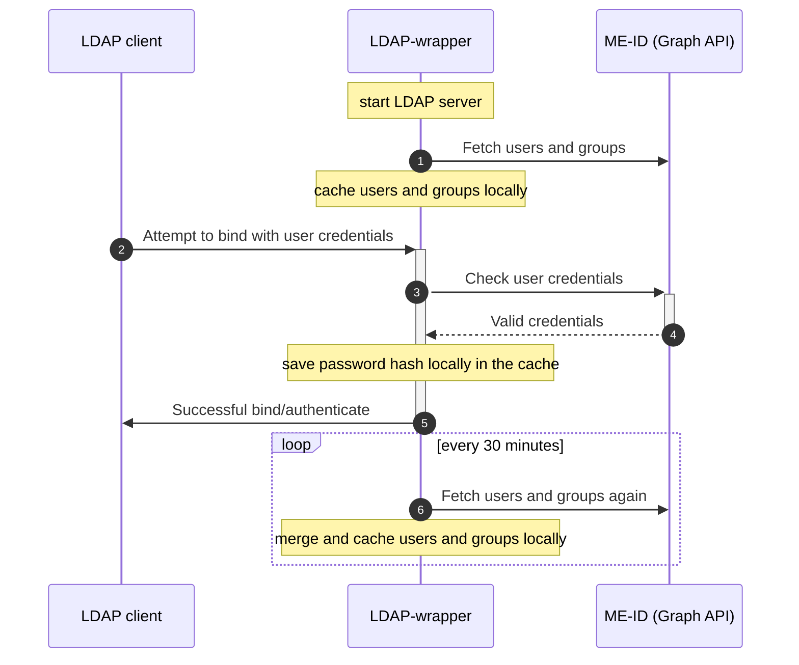

# LDAP-wrapper for Microsoft Entra ID users/groups [](https://github.com/ahaenggli/AzureAD-LDAP-wrapper) <a href="https://www.buymeacoffee.com/ahaenggli" target="_blank"></a>

LDAP-wrapper is a Node.js LDAP server built on top of ([ldapjs](https://github.com/ldapjs/node-ldapjs)) that allows users and groups from `Microsoft Entra ID` (formerly `Azure Active Directory`) to be accessed through the LDAP protocol. User authentication is performed using Microsoft Graph API on every login attempt. This allows your other applications to connect to the LDAP server and thus allows your end users to authenticate with a work or school account.

This it a possible workaround for older applications that lack Microsoft Entra ID support or for scenarios where managing a local AD controller is undesirable.

## Table of Contents

* [Background](#background)
* [Getting Started](#getting-started)
  * [Requirements](#requirements)
  * [Run the LDAP-wrapper](#run-the-ldap-wrapper)
  * [Usage](#usage)
  * [Settings](#settings)
* [Troubleshooting / FAQ](#troubleshooting-/-faq)
* [Security](#security)
* [Contributing](#contributing)
* [Support this project](#support-this-project)
* [License](#license)

## Background



The LDAP-wrapper starts an LDAP server and fetches users and groups from the Microsoft Graph API. These are cached and merged locally.

When an LDAP client attempts to bind with user credentials, the LDAP-wrapper checks these credentials by communicating with the Microsoft Graph API. If the credentials are valid, the Microsoft Graph API sends a success response to the LDAP-wrapper, which then sends a successful bind message to the user's LDAP client. Additionally, the LDAP-wrapper saves the user's password hash in the sambaNTPassword attribute and sets the sambaPwdLastSet attribute to "now". This allows the user to access samba shares, such as those on a NAS, from Windows PCs.

The LDAP-wrapper periodically fetches user and group information from the Microsoft Graph API every 30 minutes, merging and caching the results locally. This process preserves attributes like uid, gid, sambaNTPassword, and sambaPwdLastSet.

## Getting Started

### Requirements

To use the LDAP-wrapper, you will need:

* A Microsoft Entra tenant with at least one registered user.
* A Microsoft Entra application registered in your tenant, with the following permissions:
  * For type `Application` grant `User.Read.All` and `Group.Read.All`.
  * For type `Delegated` grant `User.Read`.

  You can follow the instructions in the [installation guide](https://ahaenggli.github.io/AzureAD-LDAP-wrapper/installation/create-azuread-application) to set up your application.

To run the LDAP-wrapper, you'll need to have your Tenant ID, Application ID, and Application Secret available. These values are required to authenticate and authorize the application to access your resources. You can find these values in the Microsoft Entra ID portal.

Once you have created your Microsoft Entra application, you can run the LDAP-wrapper on your local machine, on a server or even a Synology NAS. Depending on your setup you will either need:

* Node.js version 17 or higher, which can be downloaded from the official [Node.js website](https://nodejs.org/en/download/).

or

* Docker, which can be downloaded from the official [Docker website](https://www.docker.com/products/docker-desktop).

Note that some features of the wrapper may require additional configuration or dependencies, such as a  NAS for network storage access.

### Run the LDAP-wrapper

There are multiple ways to run the LDAP-wrapper. For more information, please consult the [documentation](https://ahaenggli.github.io/AzureAD-LDAP-wrapper/installation/run-ldap-wrapper/) to get started.

One way to run the LDAP-wrapper is, to start a Docker container on a Synolog NAS like this:

1. Install Docker from the Synology Package Center.


2. In Docker, go to "Registry" to download the latest container image.


3. In Docker, go to "Image" to launch a new container. Use "bridge" as your network.

Use "bridge" as your network.

4. Give your container a name and enable auto-restart.


5. Configure the environment variables in "Advanced Settings". Be sure to double check your Microsoft Entra values and define at least one binduser. The binduser (superuser like root) does not need to exist in your tenant. Replace example.com with your domain. Here is an example of a minimum required configuration:

6. Support the cert and key pem(optional)
```
openssl genrsa -out app_monitor_key.pem 2048
openssl req -new -x509 -key app_monitor_key.pem -out app_monitor_cert.pem -days 3650 -subj "/C=CN/ST=test/L=test/O=company-inc/CN=AZURE_APP_CERTIFICATE_KEY"
```
  upload the cert.pem to Azure AD 

  You can choose "AZURE_APP_SECRET" or " AZURE_APP_CERTIFICATE_PATH and AZURE_APP_CERTIFICATE_KEY_PATH"

    ```bash
    TZ: "Europe/Zurich" # optional
    AZURE_TENANTID: "0def2345-ff01-56789-1234-ab9d6dda1e1e"
    AZURE_APP_ID: "abc12345-ab01-0000-1111-a1e1eab9d6dd"
    AZURE_APP_SECRET: "iamasecret~yep-reallyreallysecret"
    AZURE_APP_CERTIFICATE_PATH="/app/app_monitor_cert.pem"
    AZURE_APP_CERTIFICATE_KEY_PATH="/app/app_monitor_key.pem"
    LDAP_DOMAIN: "example.com"
    LDAP_BASEDN: "dc=example,dc=com"
    LDAP_BINDUSER: "ldapsearch|*secretldapsearch123*||root|*secretroot*"
    LDAP_DEBUG: "false" # set this to true for more logs
    GRAPH_IGNORE_MFA_ERRORS: "false" # set this to true to bypass MFA
    DSM7: "true" # set this to false if you are running DSM 6 or lower
    ```

    
    A full list of all environment variables can be found [here](https://ahaenggli.github.io/AzureAD-LDAP-wrapper/configuration/settings/).

6. Set local Port 389 to the Container Port 13389. If you receive the error Local port 389 conflicts with other ports used by other services, make sure that Synology Directory Service and Synology LDAP Server are not installed - they also use this port.


7. Add a local folder, such as docker/ldap, to the mount path /app/.cache in the volume settings. If you skip this step, your data will not be stored permanently.


8. Click "Done" to start the container.


### Usage

To enable end users to log in to Synology NAS with their work or school account, you need to connect the NAS to the LDAP-wrapper. Here are the steps:

1. Go to Control Panel > Domain/LDAP and click "Join".


2. Enter the IP address (e.g., 127.0.0.1) of your NAS as the server address.


3. Enter the credentials of your previously defined superuser (environment variable `LDAP_BINDUSER`) as Bind DN. Should your user not be found, try writing "uid=root" or the full name "uid=root,cn=users,dc=domain,dc=tld" instead of just "root". Select your domain in Base DN.


4. If you see a warning about a local group having the same name as a synchronized group, you can ignore it and skip the warning in "Details".


5. Your NAS should now be connected successfully to the LDAP-wrapper.


6. Check the "LDAP User" and "LDAP Group" tabs to ensure that all entries are fully synced. Assign the desired permissions to your synchronized users and groups. You can now log in with your Microsoft Entra account (work or school account).


7. Note that before accessing shared folders or files via network or Samba, each user must log in to DSM web GUI or another tool directly connected to the LDAP server. This step is also required after a password change, as the password hash for Samba is only set after a successful login.

### Settings

To configure the LDAP-wrapper, you can use environment variables as it is intended to be used with Docker. A complete list of available variables can be found in the [configuration settings page](https://ahaenggli.github.io/AzureAD-LDAP-wrapper/configuration/settings) of the documentation.

## Troubleshooting / FAQ

If you encounter any issues, start by checking the Docker log. Many errors are logged there, and this can help you identify the root cause of the problem. Additionally, the [troubleshooting page](https://ahaenggli.github.io/AzureAD-LDAP-wrapper/troubleshooting/) in the documentation provides further guidance on debugging common issues, including Samba-related ones. If you're still stuck, don't hesitate to open an issue, but be sure to attach relevant log files to help others diagnose the issue.

## Security

It's important to note that the LDAP-wrapper involves transferring sensitive user information, so it's essential to ensure that it's used securely. There are several potential security risks to be aware of when using this wrapper. For more information on these risks and how to mitigate them, please read the [security page](https://ahaenggli.github.io/AzureAD-LDAP-wrapper/security/) in the documentation.

If you discover any security vulnerabilities, please refer to the instructions in [SECURITY.md](SECURITY.md) on how to report them.

## Contributing

Contributions to the LDAP-wrapper are always welcome! If you have any suggestions, bug reports, or pull requests, please feel free to open an issue or a pull request on the project's GitHub repository.

## Support this project

If you find this project helpful or saved you time and effort, please consider giving it a star and/or making a donation.

Your support helps me maintain and improve this project. Thank you!

## License

The LDAP-wrapper is licensed under the [MIT License](LICENSE).
