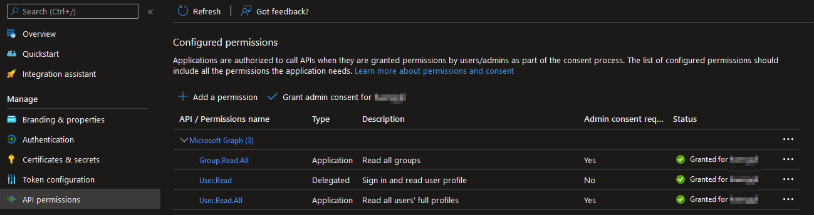
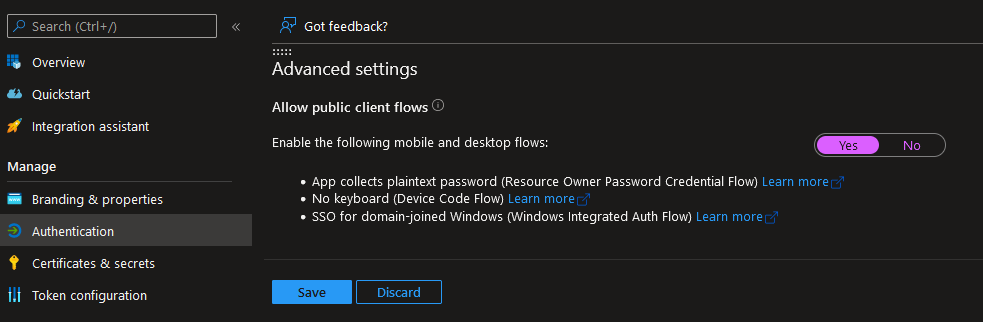

# LDAP-wrapper for AzureAD users/groups [](https://github.com/ahaenggli/AzureAD-LDAP-wrapper) <a href="https://www.buymeacoffee.com/ahaenggli" target="_blank"></a>

AzureAD-LDAP-wrapper is a nodejs ldap server ([ldapjs](https://github.com/ldapjs/node-ldapjs)) that provides AzureAD users and groups via LDAP protocol. User authentication is done each time through Microsoft Graph Api. As a result, other applications can connect to the LDAP server, allowing users to use their familiar AzureAD login information. This is especially useful for (older) applications that do not (yet) support AzureAD and for which you do not want to maintain a local AD controller.

## Table of Contents

* [Motivation and background information](#motivation-and-background-information)
  * [How the server works](#how-the-server-works)
  * [Important information about samba](#important-information-about-samba)
* [Installation](#installation)
  * [Required settings in AzureAD](#required-settings-in-azuread)
  * [Docker container - general settings](#docker-container---general-settings)
  * [Setup on a Synology NAS](#setup-on-a-synology-nas)
  * [Update Docker container on a Synology NAS](#update-docker-container-on-a-synology-nas)
  * [Synology SSO](#synology-sso)  
* [Troubleshooting](#troubleshooting)

## Motivation and background information

I personally run the project in a Docker container on my Synology NAS. The NAS and some intranet web applications are connected to the ldap server. This way my users can log in to the NAS, the web applications and of course office.com with the same credentials.
The whole thing could probably also be achieved by [joining the NAS to AADDS](https://kb.synology.com/en-global/DSM/tutorial/How_to_join_NAS_to_Azure_AD_Domain). However, I was not willing to maintain such a big setup (virtual machine/VPN/AADDS) only that my 3 users can use the same credentials (almost) everywhere.

### How the server works

1. AzureAD-LDAP-wrapper starts an LDAP server
2. On "starting" users and groups are fetched from Azure Active Directory
3. On "bind" the user credentials are checked through Microsoft Graph API
4. On successful "bind" the user password is saved as additional hash (sambaNTPassword) and sambaPwdLastSet ist set to "now". This is necessary to allow access from e.g. Windows PCs to the samba shares on the NAS.
5. Users and groups are fetched again every 30 minutes  
(while keeping uid, gid, sambaNTPassword and sambaPwdLastSet)

### Important information about samba

To access a share on the NAS, for example, from a Windows PC, the credentials must be entered. These credentials are NOT sent to the LDAP-wrapper (or any other LDAP server). They are sent to samba so that it can generate a hash from the password. Afterwards samba fetches the password hash from the LDAP-wrapper and compares the two hashes.  
Perhaps you are now wondering why this is important to know?
Well, the AzureAD-LDAP-wrapper must have this hash before you access a shared folder. Otherwise, you will get an error due to invalid credentials. Maybe you are now wondering how the LDAP-wrapper can obtain the necessary hash? The answer is simple: The user MUST first log in to a service (DSM, web application, etc.) that is directly connected to the LDAP-wrapper. Only after that the login in samba can work. The same applies after a password change. The new password has a new hash, so the user must first log in again via another service. This restriction cannot be circumvented. And last but not least: MFA/2FA (multi-factor authentication or two-factor authentication) is also not supported by this method.

## Installation

### Required settings in AzureAD

1. Register a new App in your [aad-portal](https://aad.portal.azure.com/#blade/Microsoft_AAD_IAM/ActiveDirectoryMenuBlade/RegisteredApps) as described [here](https://docs.microsoft.com/en-us/azure/active-directory/develop/howto-create-service-principal-portal).
2. Set the following Graph-API Application permissions:  

For type `Application`  allow `User.Read.All` and `Group.Read.All`.  
For type `Delegated` allow `User.Read`.
3. Set [Treat application as a public client](https://github.com/AzureAD/microsoft-authentication-library-for-dotnet/wiki/Username-Password-Authentication#application-registration) to `Yes`  
(former "Allow public client flows")
4. Copy and save those values for the later use as environment variables in the Docker container.
   - Directory (tenant) ID from the page "overview" as `AZURE_TENANTID`.  
   A description with printscreen can be found [here in #3](https://docs.microsoft.com/en-us/azure/active-directory/develop/howto-create-service-principal-portal#get-tenant-and-app-id-values-for-signing-in).
   - Application (client) ID from the page "overview" as `AZURE_APP_ID`.  
   A description with printscreen can be found [here in #4](https://docs.microsoft.com/en-us/azure/active-directory/develop/howto-create-service-principal-portal#get-tenant-and-app-id-values-for-signing-in).
   - Value of a (new) client secret from the page "Certificates & secrets" as `AZURE_APP_SECRET`.  
   A description with printscreen can be found [here in #5](https://docs.microsoft.com/en-us/azure/active-directory/develop/howto-create-service-principal-portal#option-2-create-a-new-application-secret).
5. Use a [docker container](https://hub.docker.com/r/ahaen/azuread-ldap-wrapper) (or any other method to run this LDAP-wrapper) and start it with the correct environment variables.

### Docker container - general settings

This is a minimal example for a running configuration.

```bash
AZURE_APP_ID="abc12345-ab01-0000-1111-a1e1eab9d6dd"
AZURE_TENANTID="0def2345-ff01-56789-1234-ab9d6dda1e1e"
AZURE_APP_SECRET="iamasecret~yep-reallyreallysecret"
LDAP_DOMAIN="example.com"
LDAP_BASEDN="dc=example,dc=com"
LDAP_BINDUSER="root|mystrongpw||ldapsearch|ldapsearchpw123"
```

As domain and basedn it is recommended to use the same as used in AzureAD tenant (e.g. `@domain.tld`). This way, the spelling of the users (e.g. `username@domain.tld`) will match at the end. Otherwise, your users will have to use `username@example.com` instead of the estimated `username@domain.tld`, for example.

The API results and a local copy of the LDAP entries are stored as JSON files inside the container at this path: `/app/.cache`  
Map this folder to provide persistent storage for your users/groups (and their Samba password hashes). Be aware that other users in the file system may also be able to read the JSON files and thus get access to the cached sambaNTPassword attribute.

For local testing you could create a .env file with your environment variables in there and pass it to docker run like that:

```bash
docker run -d -p 389:13389 --volume /home/mydata:/app/.cache --env-file .env ahaen/azuread-ldap-wrapper:latest
```

### Setup on a Synology NAS

1. Open Docker > Registry to download the Image  
Open Docker > Image to launch a new container  
Configure and start it

For the network use bridge as we have to map the local Port 389 to the container. Make sure you double check your Azure values and define at least 1 binduser. The binduser does not need to exist in your AzureAD. Don't forget to replace example.com with your domain. Map the `/app/.cache` folder in Volume. If you receive the error `Local port 389 conflicts with other ports used by other services`: Please make sure that Synology Directory Service and Synology LDAP Server are not installed - they also use this port.

2. Enable ldap-client and connect it to your docker container


3. Users that exist in the AAD cannot see or change other users password hashes. So, if you'd like to use samba, please join/bind with a (not in AzureAD existing) user from the previously defined env var `LDAP_BINDUSER`: 
The warning "a local group has the same name as a synchronized group" can be skipped. Should your BINDUSER not be found, try writing "uid=ldapsearch" or the full name "uid=ldapsearch,cn=users,dc=domain,dc=tld" instead of "ldapsearch".

4. Give your synchronized groups the desired permissions and log in with your synchronized users :)

5. Before accessing shared folders/files via network/samba, each user must log in to dsm-web-gui or another tool directly connected to the ldap server. This also applies after a password change, since the password hash for samba is only set after a successful login.

### Update Docker container on a Synology NAS

1. Redownload the latest version

2. Stop your container
3. Clear your container

4. Check the [changelog](CHANGELOG.md) file (for breaking changes) and apply new settings
5. Start your container
6. Check the logs for (new) errors (right click on container and choose "Details")

7. Before accessing files via network/samba, each user needs to login in the dsm-web-gui or any other tool directly connected to the ldap server. It's the same after a password change, because the password-hash for samba is only set after a successfull login.

### Synology SSO

If you don't need samba (network access for shared folders) you can try enabling the Synology OpenID Connect SSO service.
Please be aware, it's not working on every DSM version. First tests on a Synology Live Demo with DSM 7.1-42661 were successfull. Unfortunately it didn't work locally on my personal NAS, probably because it'ss behind a Firewall/Proxy.

1. Add your URL to access the NAS in Azure

2. Go to Domain/LDAP > SSO Client and  Tick Enable OpenID Connect SSO service
3. Select azure as the profile and set the same appid, tenant and secret you used for the docker container. The redirect URI is again your URL to access the NAS.

4. Save everything
5. You should now see 'Azure SSO Authentication' on your DSM login screen

