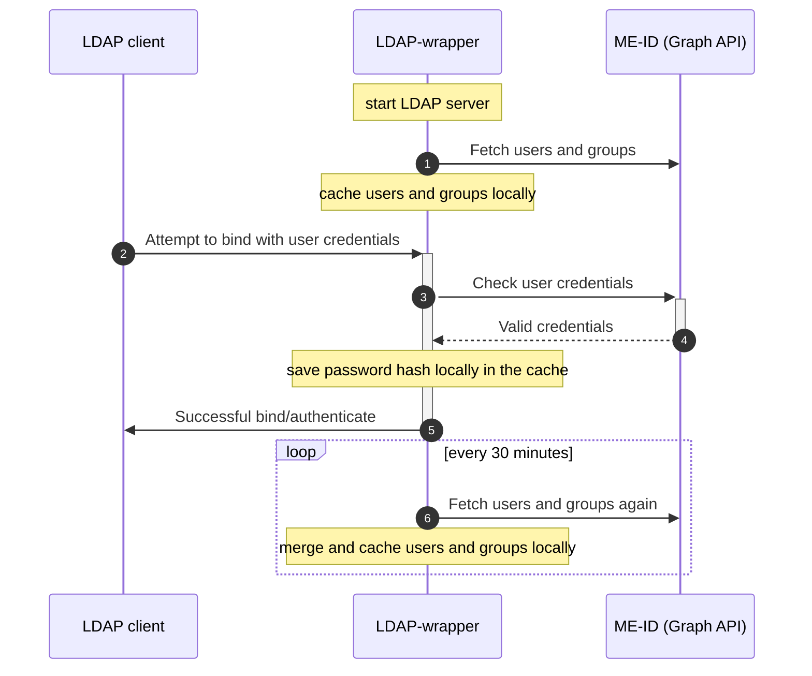

LDAP-wrapper is a Node.js LDAP server built on top of ([ldapjs](https://github.com/ldapjs/node-ldapjs)) that allows users and groups from `Microsoft Entra ID` (formerly `Azure Active Directory`) to be accessed through the LDAP protocol. User authentication is performed using Microsoft Graph API on every login attempt. This allows your other applications to connect to the LDAP server and thus allows your end users to authenticate with a work or school account.

This it a possible workaround for older applications that lack Microsoft Entra ID support or for scenarios where managing a local AD controller is undesirable.



I run the project on my Synology NAS in a Docker container. By connecting the NAS and some intranet web applications to the LDAP server, my users can log in to these services using their work accounts. Although it is possible to achieve this by [joining the NAS to AADDS](https://kb.synology.com/en-global/DSM/tutorial/How_to_join_NAS_to_Azure_AD_Domain), I preferred not to maintain such a big setup, which includes a virtual machine, VPN, and Microsoft Entra Domain Services (formerly AADDS / Azure Active Directory Domain Services), just to allow my three users to use their credentials almost everywhere.



## How the server works

The LDAP-wrapper starts an LDAP server and fetches users and groups from the Microsoft Graph API. These are cached and merged locally.

When an LDAP client attempts to bind with user credentials, the LDAP-wrapper checks these credentials by communicating with the Microsoft Graph API. If the credentials are valid, the Microsoft Graph API sends a success response to the LDAP-wrapper, which then sends a successful bind message to the user's LDAP client. Additionally, the LDAP-wrapper saves the user's password hash in the sambaNTPassword attribute and sets the sambaPwdLastSet attribute to "now". This allows the user to access samba shares, such as those on a NAS, from Windows PCs.

The LDAP-wrapper periodically fetches user and group information from the Microsoft Graph API every 30 minutes, merging and caching the results locally. This process preserves attributes like uid, gid, sambaNTPassword, and sambaPwdLastSet.
